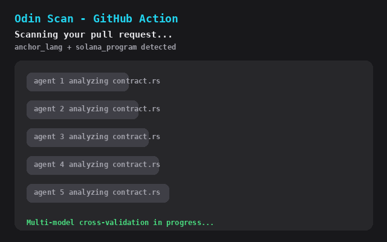

# Odin Scan GitHub Action

[](https://github.com/marketplace/actions/odin-scan)

AI-powered smart contract security analysis for CosmWasm, Solana, and EVM projects. Integrates directly into your GitHub workflow to catch vulnerabilities before they reach production.

## Demo



*Odin Scan posts a findings summary as a PR comment and uploads SARIF to Code Scanning. Pull request data shown for demonstration purposes.*

## Features

- **Multi-platform support** -- CosmWasm, Solana (SVM), and EVM (Solidity/Vyper)
- **Automatic platform detection** -- or specify explicitly
- **GitHub Code Scanning integration** -- uploads SARIF for native security alerts
- **PR comments** -- summary of findings posted directly on pull requests
- **Inline annotations** -- findings appear as errors/warnings on changed files
- **Comment-triggered scans** -- trigger on-demand scans by commenting on PRs
- **Configurable thresholds** -- fail builds based on severity level
- **Artifact upload** -- full JSON report available as workflow artifact

## Requirements

- An [Odin Scan](https://odinscan.ai) account with an API key (`odin_sk_*`)
- A GitHub repository (public or private, once scanned via the GH App)
- Standard GitHub Actions runner (`ubuntu-latest` / `node20`)

## Quick Start

```yaml
name: Security Scan
on:
  pull_request:
    branches: [main]

jobs:
  scan:
    runs-on: ubuntu-latest
    permissions:
      contents: read
      security-events: write
      pull-requests: write
    steps:
      - uses: actions/checkout@v4
      - uses: odin-scan/odin-scan-action@v1
        with:
          api-key: ${{ secrets.ODIN_SCAN_API_KEY }}
```

## Getting an API Key

1. Visit [Odin Scan Settings](https://app.odinscan.ai/settings)
2. Navigate to **API Keys**
3. Click **Create API Key**
4. Add the key as a repository secret named `ODIN_SCAN_API_KEY`

## Inputs

| Input | Required | Default | Description |
|-------|----------|---------|-------------|
| `api-key` | Yes | -- | Odin Scan API key (`odin_sk_*`) |
| `platform` | No | `auto` | Target platform: `auto`, `cosmwasm`, `solana`, `evm` |
| `severity-threshold` | No | `high` | Fail at this severity or above: `critical`, `high`, `medium`, `low`, `none` |
| `fail-on-findings` | No | `true` | Whether to fail the workflow when findings exceed threshold |
| `comment-on-pr` | No | `true` | Post summary comment on pull requests |
| `findings-visibility` | No | `full` | Detail level for public PR output: `full`, `counts`, `private` |
| `upload-sarif` | No | `true` | Upload SARIF to GitHub Code Scanning |
| `upload-artifact` | No | `true` | Upload full report as workflow artifact |
| `timeout` | No | `1800` | Max wait for analysis completion (seconds) |
| `github-token` | No | `${{ github.token }}` | GitHub token for PR comments and SARIF upload |
| `api-url` | No | `https://api.odinscan.ai` | Odin Scan API base URL |
| `trigger-phrase` | No | `@odin-scan` | Phrase in PR comments that triggers an on-demand scan |

## Outputs

| Output | Description |
|--------|-------------|
| `analysis-id` | The unique analysis identifier |
| `status` | Analysis status (`completed`, `failed`) |
| `total-findings` | Total number of findings |
| `critical-count` | Number of critical findings |
| `high-count` | Number of high findings |
| `medium-count` | Number of medium findings |
| `low-count` | Number of low findings |
| `report-url` | URL to the full report on Odin Scan |
| `sarif-file` | Path to the generated SARIF file |

## Usage Examples

### Basic (Auto-detect Platform)

```yaml
- uses: odin-scan/odin-scan-action@v1
  with:
    api-key: ${{ secrets.ODIN_SCAN_API_KEY }}
```

### EVM / Solidity

```yaml
- uses: odin-scan/odin-scan-action@v1
  with:
    api-key: ${{ secrets.ODIN_SCAN_API_KEY }}
    platform: evm
    severity-threshold: high
```

### CosmWasm

```yaml
- uses: odin-scan/odin-scan-action@v1
  with:
    api-key: ${{ secrets.ODIN_SCAN_API_KEY }}
    platform: cosmwasm
    severity-threshold: medium
```

### Solana

```yaml
- uses: odin-scan/odin-scan-action@v1
  with:
    api-key: ${{ secrets.ODIN_SCAN_API_KEY }}
    platform: solana
```

### Full Configuration

```yaml
- name: Run Odin Scan
  id: scan
  uses: odin-scan/odin-scan-action@v1
  with:
    api-key: ${{ secrets.ODIN_SCAN_API_KEY }}
    platform: auto
    severity-threshold: medium
    fail-on-findings: true
    comment-on-pr: true
    findings-visibility: full
    upload-sarif: true
    upload-artifact: true
    timeout: 1800
    github-token: ${{ secrets.GITHUB_TOKEN }}

- name: Use outputs
  if: always()
  run: |
    echo "Findings: ${{ steps.scan.outputs.total-findings }}"
    echo "Report: ${{ steps.scan.outputs.report-url }}"
```

### Only on Solidity File Changes

```yaml
on:
  pull_request:
    paths:
      - '**.sol'
      - 'foundry.toml'
      - 'hardhat.config.*'
```

## Comment-Triggered Scans

Trigger a security scan on-demand by commenting on a pull request. This is useful for re-scanning after fixes, scanning external contributor PRs on demand, or running targeted scans without automatic triggers.

### How It Works

1. A collaborator comments `@odin-scan` (or your custom trigger phrase) on a PR
2. The action adds a rocket reaction to the comment as acknowledgment
3. The scan runs against the PR's head branch and commit
4. Results are posted as a PR comment (and optionally uploaded as SARIF/artifact)

### Workflow Setup

Your workflow must listen to the `issue_comment` event. Use a job-level `if:` guard to avoid spinning up runners for every comment:

```yaml
name: Odin Scan (Comment Trigger)
on:
  issue_comment:
    types: [created]

jobs:
  security-scan:
    if: >-
      github.event.issue.pull_request &&
      contains(github.event.comment.body, '@odin-scan')
    runs-on: ubuntu-latest
    permissions:
      contents: read
      security-events: write
      pull-requests: write
    steps:
      - uses: actions/checkout@v4
        with:
          ref: refs/pull/${{ github.event.issue.number }}/merge
      - uses: odin-scan/odin-scan-action@v1
        with:
          api-key: ${{ secrets.ODIN_SCAN_API_KEY }}
          trigger-phrase: '@odin-scan'
```

### Combined Workflow (Auto + Comment Trigger)

You can combine automatic PR scans and comment-triggered scans in a single workflow file using separate jobs:

```yaml
on:
  pull_request:
    branches: [main]
  issue_comment:
    types: [created]

jobs:
  auto-scan:
    if: github.event_name == 'pull_request'
    # ... standard scan setup ...

  comment-scan:
    if: >-
      github.event_name == 'issue_comment' &&
      github.event.issue.pull_request &&
      contains(github.event.comment.body, '@odin-scan')
    # ... comment-triggered scan setup ...
```

See `example-workflows/combined.yml` for the full example.

### Important Notes

- **Checkout ref**: The `issue_comment` event checks out the default branch by default. You must use `ref: refs/pull/${{ github.event.issue.number }}/merge` in `actions/checkout` to get the PR code.
- **Job-level `if:` guard**: Without it, every comment on every issue and PR will spin up a runner. The action will exit silently for non-matching comments, but you still pay for the runner startup time.
- **Custom trigger phrase**: Set `trigger-phrase` to any string (e.g., `/scan`, `@security-check`). Both `@` and `/` prefixes are recognized interchangeably.
- **Bot loop prevention**: Comments from bots (`sender.type === 'Bot'`) are automatically ignored.

## GitHub Code Scanning (SARIF)

When `upload-sarif` is enabled (default), findings are uploaded to GitHub Code Scanning. This provides:

- Native security alerts in the **Security** tab
- Inline annotations on pull request diffs
- Alert tracking and dismissal workflows
- Integration with GitHub's security overview

**Required permission:**
```yaml
permissions:
  security-events: write
```

Note: GitHub Code Scanning requires GitHub Advanced Security on private repositories.

## Permissions

The action requires these permissions depending on enabled features:

```yaml
permissions:
  contents: read          # Always required (checkout)
  security-events: write  # Required for SARIF upload
  pull-requests: write    # Required for PR comments
```

## Public Repository Security

On public repositories, PR comments and inline annotations are visible to anyone. When the action reports a vulnerability with its title, file location, and description, a threat actor monitoring the repository can read those details and exploit the issue before your team fixes it.

The `findings-visibility` input controls how much detail is exposed in these two public channels (PR comments and inline annotations). It does **not** affect SARIF uploads or workflow artifacts, which are already permission-gated by GitHub.

### Why three modes instead of a simple on/off toggle

A binary "redact findings" flag would force a choice between showing everything or showing nothing. In practice there are three distinct threat profiles, each needing a different level of disclosure:

| Mode | PR Comment | Annotations | Threat model |
|------|-----------|-------------|--------------|
| `full` | Severity table + finding details (titles, locations, descriptions) | Emitted | **Private repos** where all viewers are trusted. No information asymmetry to exploit. |
| `counts` | Severity table only -- no titles, file paths, or descriptions | Suppressed | **Public repos** where the team wants an aggregate "how bad is this PR" signal without broadcasting *which* vulnerability or *where* it lives. An attacker learns "2 critical findings" but not what they are. |
| `private` | "Findings detected -- see private report" + link only | Suppressed | **Public repos with production code** where even revealing counts could signal that a PR touches something security-sensitive and motivate targeted review of the diff. |

### Annotation suppression

Inline annotations (`core.error` / `core.warning`) render directly on the PR diff with the full vulnerability title, file path, and description. On a public repo they are just as visible as the PR comment itself. When `findings-visibility` is set to `counts` or `private`, annotations are suppressed entirely so that the disclosure control is airtight across both channels.

### Zero-findings behavior

In `full` and `counts` modes the comment shows "No security findings detected." In `private` mode it shows the neutral "Security analysis complete." to avoid leaking even the absence of findings as a signal.

### Example

```yaml
- uses: odin-scan/odin-scan-action@v1
  with:
    api-key: ${{ secrets.ODIN_SCAN_API_KEY }}
    findings-visibility: private
```

### Unaffected channels

- **SARIF / Code Scanning** -- results are only visible to users with security permissions, even on public repos.
- **Workflow artifacts** -- require repository write access to download.

## Troubleshooting

### "Invalid API key"

Verify the `ODIN_SCAN_API_KEY` secret is set correctly in your repository settings. API keys start with `odin_sk_`.

### "Analysis timed out"

Large repositories may take longer to analyze. Increase the `timeout` input (default is 1800 seconds / 30 minutes).

### "Failed to upload SARIF"

Ensure the workflow has `security-events: write` permission. On private repositories, GitHub Advanced Security must be enabled.

### "Failed to post PR comment"

Ensure the workflow has `pull-requests: write` permission and is triggered by a `pull_request` or `issue_comment` event.

### Analysis fails immediately

Check that your repository contains supported contract files:
- **EVM**: `.sol` files with Foundry/Hardhat config
- **CosmWasm**: Rust files with `cosmwasm-std` dependency
- **Solana**: Rust files with Anchor or native Solana program structure

## License

MIT
